# 🧬 Scientific-Resoning: AI-Powered Scientific Discovery Platform

---

### ✨ **Revolutionizing Scientific Research Through AI-Powered Graph Reasoning** ✨

*The first production-ready platform that transforms complex research problems into systematic, graph-based knowledge discovery pipelines*

---

## 🚀 Scientific reasoning: The Complete Solution

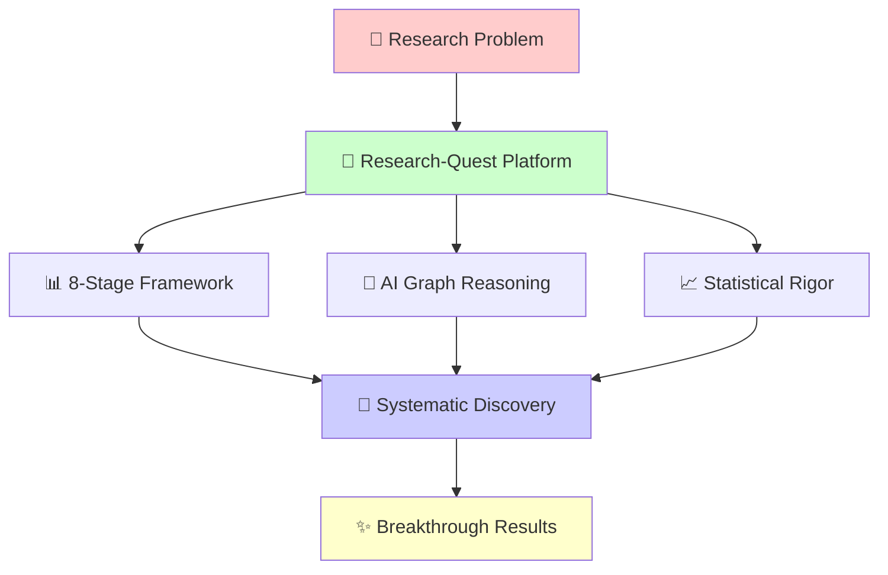

### 🌟 **Core Innovation Pillars**

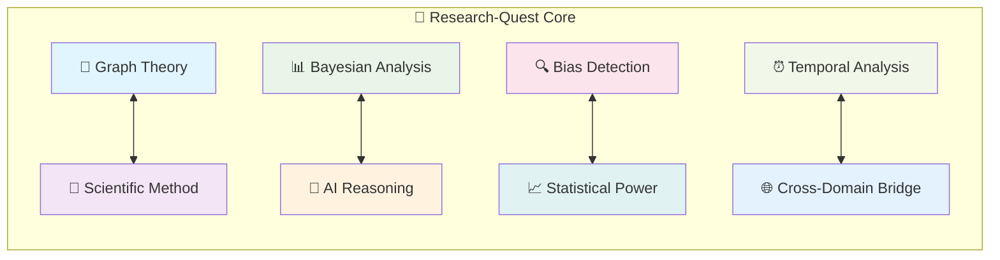

---

## 🛠️ The 8-Stage Research Framework

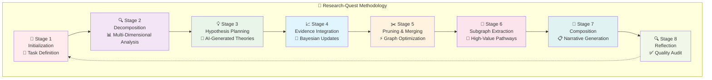

### 🔬 **Stage Deep Dive**

<b>📊 Click to explore each stage in detail</b>

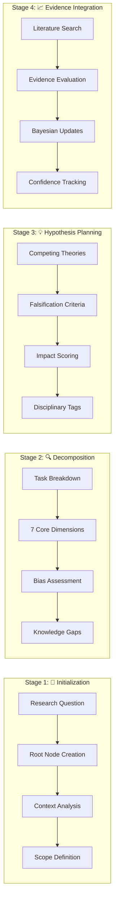

---

## 🏗️ Technical Architecture

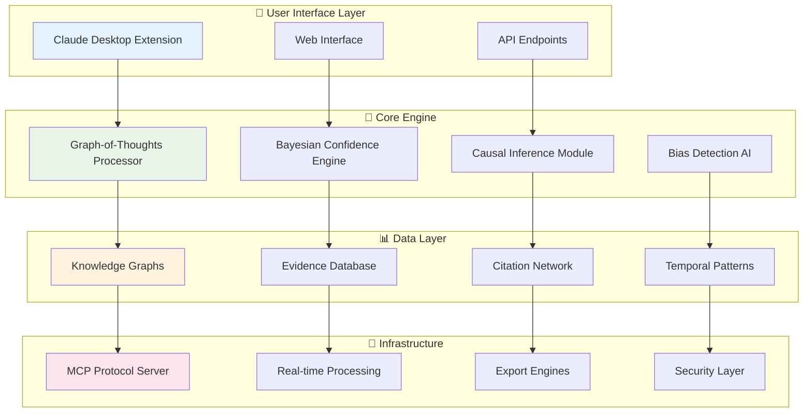

### 🎯 **Mathematical Foundation**

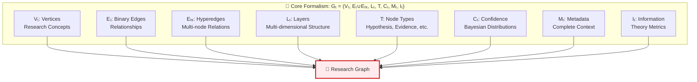

---

## 🎯 User Journey & Workflows

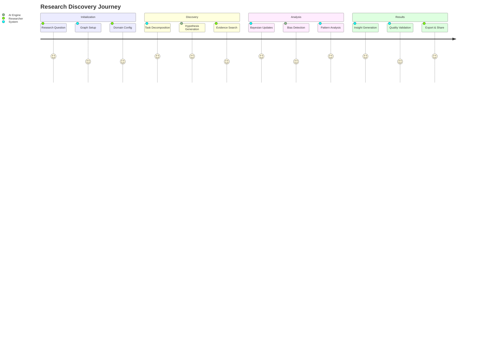

### 🚀 **Quick Start Workflow**

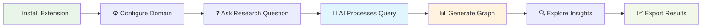

---

## 🧠 Research Methodology Mind Map

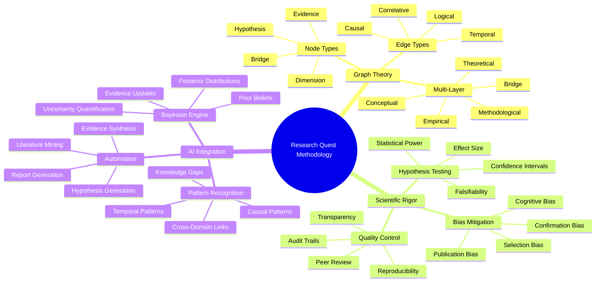

---

## 🌟 Key Features Showcase

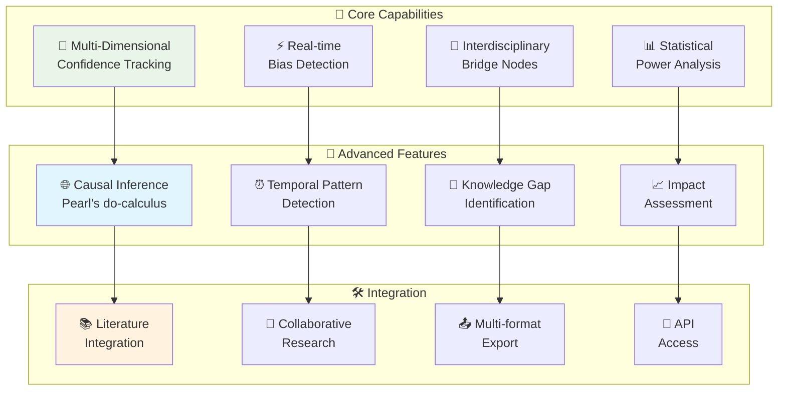

---

## 📊 Technology Stack Visualization

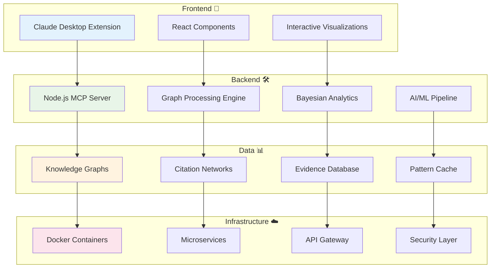

---

## 🎯 Domain Applications

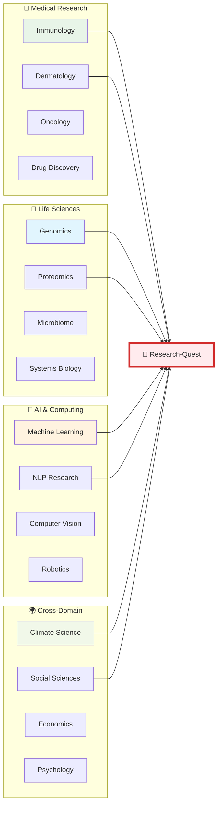

---

## 🚀 Installation & Setup

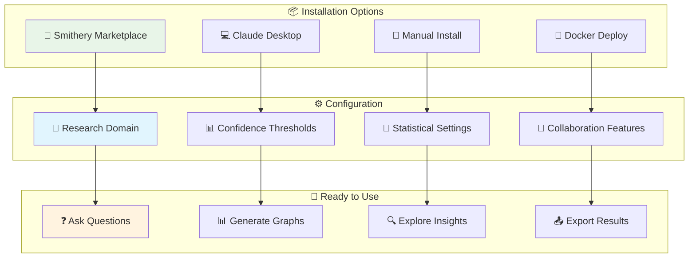

## 🔍 Example Research Flow

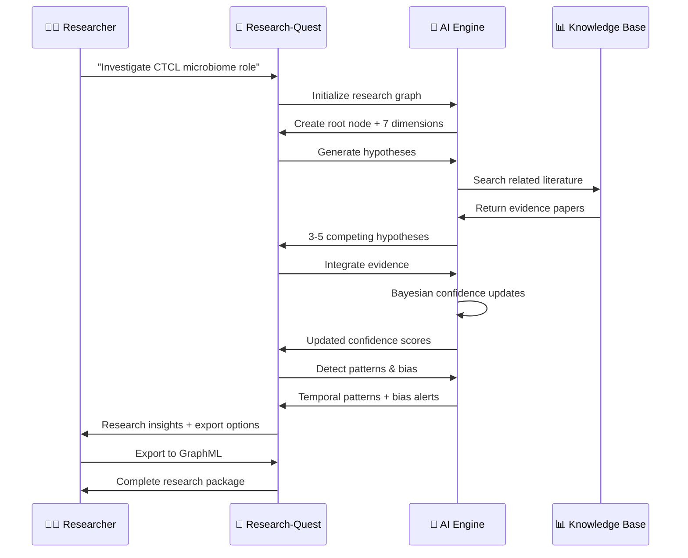

