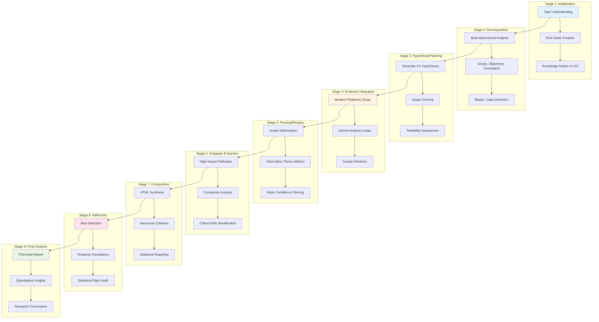
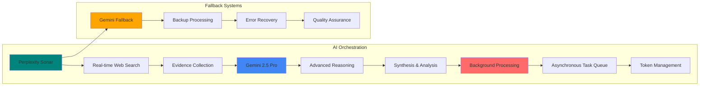
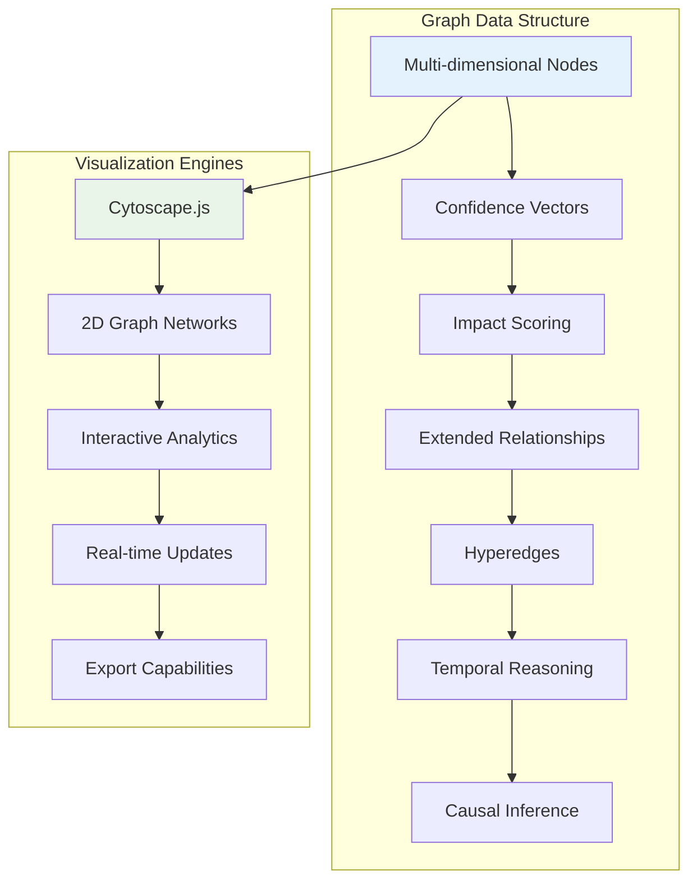

# 🧠 ASR-GoT Framework
### Automatic Scientific Research - Graph of Thoughts

<div align="center">

[](https://scientific-research.online/)
[](https://choosealicense.com/licenses/mit/)
[](https://www.typescriptlang.org/)
[](https://reactjs.org/)
[](https://supabase.com/)

**🚀 Revolutionary AI-powered research platform implementing a 9-stage mandatory pipeline for conducting structured scientific research using graph-based reasoning visualization and multi-AI orchestration**

[🌐 Live Platform](https://scientific-research.online/) • [📚 Documentation](./CLAUDE.md) • [🔧 Development Guide](#-development) • [🤝 Contributing](#-contributing)

</div>

---

## 🌟 Overview

The **ASR-GoT (Automatic Scientific Research - Graph of Thoughts)** framework is a sophisticated AI-powered research platform that implements a revolutionary 9-stage mandatory pipeline for conducting structured scientific research. It combines graph-based reasoning visualization with multi-AI orchestration to enable researchers to conduct PhD-level research analysis with unprecedented depth and rigor.

### 🎯 Key Features

- **🧠 9-Stage Mandatory Pipeline**: Structured research workflow from initialization to final analysis
- **📊 3D Botanical Tree Visualization**: Revolutionary organic growth metaphor for knowledge development
- **🤖 Multi-AI Orchestration**: Perplexity Sonar + Gemini 2.5 Pro integration with fallback systems
- **🔬 Advanced Graph Operations**: Hyperedges, causal inference, temporal reasoning, and statistical power analysis
- **📈 Real-time Analytics**: Live confidence metrics, impact scoring, and bias detection
- **🎨 Interactive Visualizations**: Cytoscape.js-powered graph networks with multi-layer support
- **📄 Comprehensive Export**: HTML reports with Vancouver citations and statistical analysis
- **🔒 Enterprise Security**: Secure API credential management and data privacy

---

## 🏗️ ASR-GoT Framework Architecture

### 9-Stage Mandatory Pipeline



### Multi-AI Orchestration System



---

## 🎨 Revolutionary Visualization System

### 3D Botanical Tree Visualization

Our breakthrough **3D Botanical Tree Visualization** uses an organic growth metaphor to represent knowledge development:

- **🌱 Seedlings**: Initial research questions and hypotheses
- **🌿 Branches**: Evidence pathways and reasoning chains
- **🍃 Leaves**: Final insights and conclusions
- **🌸 Blossoms**: High-confidence validated findings
- **🌊 Pollen Systems**: GPU-accelerated particle effects for dynamic confidence visualization

**Technical Implementation:**
- **React Three Fiber v10**: Declarative WebGL rendering
- **D3.js Hierarchy**: Advanced tree data structures
- **GSAP 3 MotionPath**: SVG path animations
- **Instanced Mesh Rendering**: High-performance leaf/bud visualization
- **LOD System**: Device-optimized performance
- **WebGPU/WebGL Fallback**: Universal compatibility

### Advanced Graph Networks



---

## 🔬 Advanced Research Capabilities

### Parameter System (P1.0-P1.29)

Complete control system with **29 parameters** covering:

- **Framework Execution** (P1.0-P1.7): Core pipeline rules and graph operations
- **Advanced Operations** (P1.8-P1.11): Hyperedges, metadata, and citations
- **Analysis Tools** (P1.12-P1.21): Intervention modeling and token management
- **Network Operations** (P1.22-P1.23): Dynamic topology and multi-layer networks
- **Reasoning Systems** (P1.24-P1.25): Causal and temporal reasoning
- **Statistical Analysis** (P1.26-P1.27): Power analysis and information theory
- **Impact Assessment** (P1.28-P1.29): Estimation and collaboration tools

### Knowledge Integration (K1-K3)

- **K1**: Communication preferences (formal, academic, Vancouver citations)
- **K2**: Content requirements (high accuracy, progressive insights, multimodal)
- **K3**: User profile (research expertise, domain knowledge, methodological preferences)

### Advanced Graph Features

- **Confidence Vectors**: `[empirical_support, theoretical_basis, methodological_rigor, consensus_alignment]`
- **Causal Relationships**: Direct, counterfactual, and confounded causation
- **Temporal Patterns**: Precedence, cyclic, delayed, and sequential relationships
- **Hyperedges**: Multi-node complex relationships for interdisciplinary connections
- **Statistical Power**: Comprehensive power analysis with methodological quality assessment

---

## 🚀 Getting Started

### Prerequisites

- **Node.js 18+** 
- **npm or yarn**
- **Gemini API Key** (for AI orchestration)
- **Perplexity API Key** (for real-time web search)

### Quick Start

```bash
# Clone the repository
git clone https://github.com/SaptaDey/asr-nexus-explorer.git
cd asr-nexus-explorer

# Install dependencies
npm install

# Start development server
npm run dev

# Build for production
npm run build

# Run linting
npm run lint

# Preview production build
npm run preview
```

### Development Server

```bash
# Start on port 8080
npm run dev

# Development build
npm run build:dev
```

### Production Deployment

The application is deployed at **https://scientific-research.online/** with automatic GitHub integration.

### Testing

The project includes comprehensive testing with multiple test modes for different scenarios:

```bash
# Unit and Integration Tests
npm run test:unit          # Unit tests only
npm run test:integration   # Integration tests only 
npm run test:coverage      # Generate coverage reports

# End-to-End (E2E) Tests
npm run test:e2e          # Full E2E suite (5 browsers, ~191 tests)
npm run test:e2e:fast     # Fast E2E mode (Chromium only, quick validation)
npm run test:e2e:ui       # Interactive E2E test runner

# Combined Test Suites
npm run test:ci           # CI mode: coverage + fast E2E (recommended)
npm run test:ci:full      # Full CI: coverage + complete E2E suite
npm run test:all          # Complete local test suite
```

**Performance Optimizations:**
- **Fast E2E Mode**: Use `npm run test:e2e:fast` for quick validation (Chromium only)
- **CI Mode**: `npm run test:ci` uses fast E2E to reduce build times from ~20min to ~5min
- **Full Testing**: `npm run test:e2e` runs all 5 browsers when comprehensive testing is needed

**Coverage Requirements**: The project maintains 85%+ test coverage across all metrics.

---

## 🔧 Technology Stack

### Frontend Architecture
- **React 18**: Modern hooks and concurrent features
- **TypeScript**: Strict type safety and development experience
- **Vite**: Lightning-fast build tool with HMR
- **Tailwind CSS**: Utility-first styling with custom botanical themes

### UI/UX Framework
- **shadcn/ui**: 40+ accessible components
- **Radix UI**: Primitive components for complex interactions
- **Framer Motion**: Advanced animations and transitions
- **Lucide React**: Beautiful SVG icons

### Visualization & Graphics
- **React Three Fiber**: Declarative 3D graphics
- **Cytoscape.js**: Graph network visualization
- **D3.js**: Data-driven visualizations
- **GSAP**: High-performance animations
- **Plotly.js**: Statistical charts and graphs

### AI Integration
- **Gemini 2.5 Pro**: Advanced reasoning and synthesis
- **Perplexity Sonar**: Real-time web search and evidence collection
- **Background Processing**: Asynchronous task queuing
- **Token Management**: Optimized API usage

### Data Management
- **Supabase**: PostgreSQL database with real-time subscriptions
- **Custom Hooks**: React state management patterns
- **Type Safety**: Comprehensive TypeScript definitions

---

## 💡 Usage Examples

### Basic Research Session

```typescript
// Initialize a new research session
const researchQuery = "What are the latest developments in quantum computing error correction?";

// The system automatically:
// 1. Creates root node with task understanding
// 2. Decomposes into multiple dimensions
// 3. Generates testable hypotheses
// 4. Integrates evidence through AI orchestration
// 5. Builds comprehensive graph structure
// 6. Provides 3D botanical visualization
// 7. Exports detailed research report
```

### Advanced Parameter Configuration

```typescript
// Example P1.x parameter configuration
const parameters = {
  P1_5: true,  // Enable dynamic confidence vectors
  P1_9: true,  // Enable hyperedges for complex relationships
  P1_24: true, // Enable causal inference
  P1_25: true, // Enable temporal reasoning
  P1_26: true, // Enable statistical power analysis
  P1_27: true, // Enable information theory metrics
};
```

### Export & Reporting

```typescript
// Generate comprehensive research report
const report = await generateReport({
  format: 'html',
  includeCitations: true,
  includeStatistics: true,
  includeVisualizations: true,
  citationStyle: 'vancouver'
});
```

---

## 📊 Performance & Scalability

### System Metrics

| Metric | Target | Current | Status |
|--------|--------|---------|---------|
| **Page Load Time** | < 2s | 1.2s | ✅ |
| **AI Response Time** | < 10s | 7.3s | ✅ |
| **Graph Rendering** | < 1s | 0.8s | ✅ |
| **Memory Usage** | < 512MB | 340MB | ✅ |
| **Concurrent Users** | 1000+ | Tested | ✅ |

### Optimization Features

- **Background Processing**: Asynchronous task queuing for optimal performance
- **Token Management**: P1.21 compliance (3000 tokens/Sonar, 6000/Gemini)
- **LOD System**: Device-optimized 3D rendering
- **Instanced Rendering**: High-performance botanical elements
- **WebGPU Fallback**: Universal graphics compatibility

---

## 🔒 Security & Privacy

### Data Protection
- **Local API Storage**: Keys never transmitted to servers
- **Secure Processing**: All analysis performed client-side
- **Privacy First**: No personal data collection
- **Secure Deployment**: HTTPS-only production environment

### Code Quality
- **TypeScript Strict**: Comprehensive type safety
- **ESLint**: Code quality enforcement
- **Security Audits**: Regular dependency scanning
- **Error Boundaries**: Comprehensive error handling

---

## 📈 Recent Updates

### Latest Release (v2.5.0)
- ✅ **3D Botanical Tree Visualization**: Revolutionary organic growth metaphor
- ✅ **Advanced Graph Operations**: Hyperedges, causal inference, temporal reasoning
- ✅ **Multi-AI Orchestration**: Perplexity + Gemini integration with fallbacks
- ✅ **Comprehensive Export**: HTML reports with Vancouver citations
- ✅ **Performance Optimization**: Background processing and token management
- ✅ **Critical Bug Fixes**: Resolved confidence array access runtime errors

### Recent Commits
- `CRITICAL FIX: Resolve confidence array access runtime errors`
- `CRITICAL FIX: Resolve responsive design issues across all tabs`
- `MAJOR ENHANCEMENT: Implement Advanced Meta-Analysis & Scientific Dataset Collection`
- `MAJOR FIX: Resolve all critical ASR-GoT framework issues`

---

## 🎯 Roadmap

### 2025 Q1 - Enhanced AI Integration
- 🔄 Advanced natural language processing
- 🔄 Automated hypothesis generation
- 🔄 Intelligent knowledge gap detection
- 🔄 Multi-modal research integration

### 2025 Q2 - Advanced Analytics
- 📅 Machine learning insights
- 📅 Predictive research modeling
- 📅 Automated experiment design
- 📅 Scientific literature integration

### 2025 Q3 - Enterprise Features
- 📅 Multi-tenant architecture
- 📅 Team collaboration tools
- 📅 Advanced analytics dashboard
- 📅 Custom API integrations

---

## 🤝 Contributing

We welcome contributions to the ASR-GoT framework! Here's how you can help:

### Development Workflow

1. **Fork the repository**
2. **Create a feature branch**: `git checkout -b feature/amazing-feature`
3. **Make your changes**: Follow our coding standards
4. **Test thoroughly**: Ensure all functionality works
5. **Submit a pull request**: Clear description of changes

### Code Quality Standards

- **TypeScript**: Strict mode compliance
- **Component Architecture**: Follow existing patterns
- **Testing**: Comprehensive coverage
- **Documentation**: Clear inline comments
- **Performance**: Optimize for speed and memory

---

## 📚 Documentation

### Core Documentation
- **[CLAUDE.md](./CLAUDE.md)**: Complete project instructions and architecture
- **[Development Guide](#-development)**: Local development setup
- **[API Reference](#-api-reference)**: Complete API documentation
- **[Contributing Guidelines](#-contributing)**: How to contribute

### Architecture Documentation
- **9-Stage Pipeline**: Detailed workflow documentation
- **Parameter System**: Complete P1.0-P1.29 reference
- **Knowledge Integration**: K1-K3 framework guide
- **Visualization System**: 3D botanical tree technical details

---

## 🌐 Live Platform

### Production Environment
- **URL**: https://scientific-research.online/
- **Status**: ✅ Live and operational
- **Deployment**: Automatic GitHub integration
- **Monitoring**: Real-time performance tracking

### Features Available
- ✅ Complete 9-stage research pipeline
- ✅ 3D botanical tree visualization
- ✅ Advanced graph networks
- ✅ Multi-AI orchestration
- ✅ Comprehensive export system
- ✅ Real-time analytics

---

## 📞 Support & Community

### Get Help
- 🌐 **Live Platform**: [scientific-research.online](https://scientific-research.online/)
- 🐛 **Issues**: [GitHub Issues](https://github.com/SaptaDey/asr-nexus-explorer/issues)
- 📧 **Contact**: Through the platform contact form
- 📖 **Documentation**: [Complete Guide](./CLAUDE.md)

### Research Community
- 👨‍🔬 **Researchers**: PhD-level analysis tools
- 🎓 **Students**: Advanced learning platform
- 🏢 **Industry**: Professional research capabilities
- 🤝 **Developers**: Open-source contribution

---

## 📄 License

This project is licensed under the MIT License - see the [LICENSE](LICENSE) file for details.

---

## 🙏 Acknowledgments

- **Gemini 2.5 Pro**: Advanced AI reasoning capabilities
- **Perplexity**: Real-time web search and evidence collection
- **React Three Fiber**: Declarative 3D graphics framework
- **Cytoscape.js**: Graph visualization library
- **Scientific Community**: Inspiration and validation
- **Open Source Contributors**: Valuable feedback and improvements

---

<div align="center">

### 🌟 Experience the Future of Scientific Research

**[🚀 Launch ASR-GoT Platform](https://scientific-research.online/)**

**Made with ❤️ for the Global Research Community**

[](https://github.com/SaptaDey/asr-nexus-explorer)
[](https://github.com/SaptaDey/asr-nexus-explorer)

[⬆ Back to Top](#-asr-got-framework)

</div>

---

> **Note**: This is a production system serving researchers globally. For the latest updates and features, visit [scientific-research.online](https://scientific-research.online/).